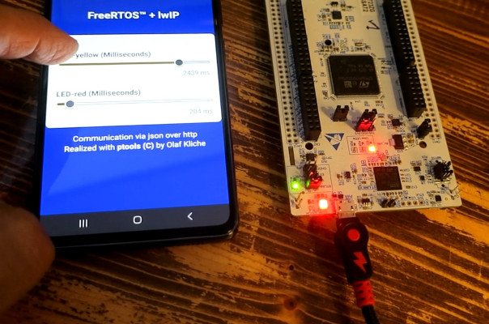

# webServer - on embedded STM NUCLEO-H723ZG
## C / C++ 20, FreeRTOS, LwIP, ptools

### Based on original example code from STM 
[github.com/STM.../LwIP/LwIP_HTTP_Server_Netconn_RTOS](https://github.com/STMicroelectronics/STM32CubeH7/tree/master/Projects/NUCLEO-H723ZG/Applications/LwIP/LwIP_HTTP_Server_Netconn_RTOS)

Original example shows 2 STM pages - 1st static board info and 2nd dynamic page showing RTOS threads

Modified code h7webserver shows same pages + some more.   
STM pages are generated by C code, interactive pages are from C++20 ptools at [github.com/okl-tools/ptools](https://github.com/okl-tools/ptools) . 
This picture shows C++ app page on mobile controlling 2 LEDs on NUCLEO board

## Receipe to build and run the  h7webserver

### The fast way - get all-in-one-zip from my tools page <a href = "https://tools.okl.de" target="tools_okl">tools.okl.de</a> 
- download, unpack, start buildElf.sh, flash - done 
  (if cmake and arm toolchain are reachable from console you can do this all in less than one minute)
- bonus: picture above is from a 20 seconds clip on <a href = "https://tools.okl.de" target="tools_okl">tools.okl.de</a> 

 
### Recommended, go this way to learn more about Nucleo board, software, ...
- connect your NUCLEO-H723ZG with USB for flashing and terminal access.
- connect your NUCLEO-H723ZG with Ethernet cable to you switch/router
- ensure to have a working arm toolchain, not too old. - 14.2 but 12 or 13 should be good also  
inside bash type 
**arm-none-eabi-g++ --version**  
*which should show you something like*  
  arm-none-eabi-g++ (xPack GNU Arm Embedded GCC x86_64) 14.2.1 20241119
  Copyright (C) 2024 Free Software Foundation, Inc.

- cmake 3.22 or higher
- terminal program, "picocom" recommended

- 3 Repositories to clone
  - git clone https://github.com/STMicroelectronics/STM32CubeH7/tree/master  
    I recommend to do this because than you are sure to have all driver code
    and original examples. Unfortunately it is really big - 2.4 GB

  - git clone https://github.com/okl-tools/ptools   200 KB only  
    ptools is a C++ 20 lib which makes a bridge between C and C++ 20.

  - git clone https://github.com/okl-tools/h7webServer  
    This code - h7webServer - fork of [github.com/STM .../LwIP_HTTP_Server_Netconn_RTOS](https://github.com/STMicroelectronics/STM32CubeH7/tree/master/Projects/NUCLEO-H723ZG/Applications/LwIP/LwIP_HTTP_Server_Netconn_RTOS)

If all stuff is on you hard disk open a shell and go inside h7webServer folder 
We need 4 symlinks (ln -s) to be made in this directory.
The first 3 point to 3 directories of the big STM32CubeH7 repository.
The 4th to ptools 

The links you see here within [h7webServer] folder point to the stuff in <b>my environment</b>. 
So create them and let them point to your downloaded repos.

<pre>
Drivers -> /cppDev/E/stm32/H7/v12.1/STM32CubeH7/Drivers/
FreeRTOS -> /cppDev/E/stm32/H7/v12.1/STM32CubeH7/Middlewares/Third_Party/FreeRTOS/
LwIP -> /cppDev/E/stm32/H7/v12.1/STM32CubeH7/Middlewares/Third_Party/LwIP/
ptools -> /cppDev/E/ptools/
</pre>

Allright, links are set and now ...

<pre>
/cppDev/E/H723ZG/h7webServer$ mkdir build
/cppDev/E/H723ZG/h7webServer$ cd build/
/cppDev/E/H723ZG/h7webServer/build$ cmake ..
/cppDev/E/H723ZG/h7webServer/build$ make -j 8 

/cppDev/E/H723ZG/h7webServer/build$ ls -l *.elf
-rwxrwxr-x 1 267332 Jun 18 16:38 h7webServer.elf
</pre>

**time to flash**

Now it's time to play.
The boards software has dhcp capabilities.
In which state is our server ? We also want to know about <b>IP adress</b> the board is using.
For this we start a terminal program which communicates via serial protocol.
With picocom I do 
<b>picocom --imap lfcrlf /dev/ttyACM0 -b 115200</b>  
Normally it's serial over USB - same cable to flash the board.
Terminal program should detect LF as line end - not CRLF. 
If CRLF our lines look crazy and not good readable.  
In our browser we type http://192.168.1.6    
It is exactly the IP found in the output of terminal.   
The main page with 3 buttons will appear in the browser.   
Choose **LED control** and have fun!

Tip: If your terminal is connected and you do not see any output press the reset button on your board.

Example output - here you find the IP in log message [000007] 

[Number] [Time] [Thread-ID]

<pre>
iface@bigbox:~$ picocom --imap lfcrlf /dev/ttyACM0 -b 115200

[000001] [00:00:00,000][000000000] ********************************
[000002] [00:00:00,000][000000000] *** BOOT SYSTEM ****************
[000003] [00:00:00,000][000000000] *** Simple Web Server 0.29 *****
[000004] [00:00:00,000][000000000] ********************************
[000005] [00:00:00,000][536906808] Watchdog barking at ~4 seconds
[000006] [00:00:00,002][536906808] ini_my_threads
[000007] [00:00:03,505][536916000] IP:192.168.1.6
[000008] [00:00:15,413][536922256]     PRequest all: 'GET / HTTP/1.1'
[000009] [00:00:15,419][536922256]           method: 'GET'
[000010] [00:00:15,424][536922256]           target: '/'
[000011] [00:00:15,429][536922256]          version: '1.1'
[000012] [00:00:15,434][536922256] GET / HTTP/1.1
[000013] [00:01:01,005][536923592] heart 1 beat times
[000014] [00:01:09,095][536922256]     PRequest all: 'GET /blinky HTTP/1.1'
[000015] [00:01:09,101][536922256]           method: 'GET'
[000016] [00:01:09,106][536922256]           target: '/blinky'
[000017] [00:01:09,112][536922256]          version: '1.1'
[000018] [00:01:09,117][536922256] GET /blinky HTTP/1.1
[000019] [00:01:09,132][536922256] POST /api/led HTTP/1.1
[000020] [00:01:09,137][536922256]     PRequest all: 'POST /api/led HTTP/1.1'
[000021] [00:01:09,144][536922256]           method: 'POST'
[000022] [00:01:09,149][536922256]           target: '/api/led'
[000023] [00:01:09,155][536922256]          version: '1.1'
[000024] [00:01:09,161][536922256]         Node
[000025] [00:01:09,165][536922256]             led_yellow
[000026] [00:01:09,170][536922256]                 numberValue:500.00
[000027] [00:01:09,177][536922256]             led_red
[000028] [00:01:09,181][536922256]                 numberValue:500.00
[000029] [00:01:09,188][536922256] 
[000030] [00:01:14,080][536922256] POST /api/led HTTP/1.1
[000031] [00:01:14,085][536922256]     PRequest all: 'POST /api/led HTTP/1.1'
[000032] [00:01:14,092][536922256]           method: 'POST'
[000033] [00:01:14,097][536922256]           target: '/api/led'
[000034] [00:01:14,102][536922256]          version: '1.1'
[000035] [00:01:14,108][536922256]         Node
[000036] [00:01:14,113][536922256]             led_yellow
[000037] [00:01:14,118][536922256]                 numberValue:223.00
[000038] [00:01:14,124][536922256]             led_red
[000039] [00:01:14,129][536922256]                 numberValue:500.00
[000040] [00:01:14,135][536922256] 
</pre>

